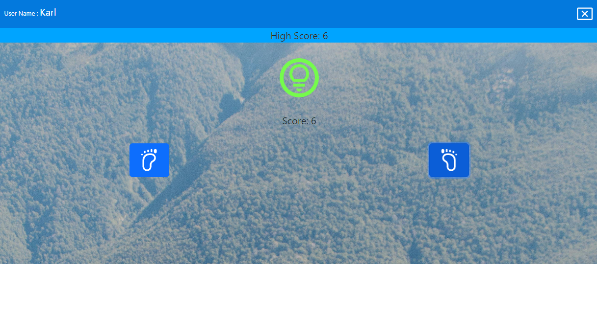

# Walk app game Red Light, Green Light

## Prerequisites

Before you start, you need to install and configure the tools:

* [git](https://git-scm.com/)
* [Node.js and npm](https://nodejs.org/)
* [Angular CLI](https://angular.io/cli)
* IDE (e.g. [Visual Studio Code](https://code.visualstudio.com/))

## Getting started

Installing dependencies from package.json

* npm i

## Start application

* npm start

## Start application PWA

* Generate a production build → 'serve-http-pwa' (npm run serve-http-pwa) -  This will create a new folder under your root application called dist. Your app files will be under docs.

* Open browser in this path : http//localhost: 8080 (for the correct PWA is need https or http://localhost:8080)

All of a sudden you will see a button in the chrome browser which can install your application and open in window popup

## Build

Run `ng build` (or npm run build) to build the project. The build artifacts will be stored in the `docs/` directory.

## Running unit tests

Run `ng test` (or npm run test) to execute the unit tests via [jest](https://jestjs.io/).

## Play walk 

To play it is necessary to press one step button at a time and so the score increases, if you press the same button twice in a row it decreases the score. You have to wait for the green light to press the buttons. There will be a maximum score obtained by the user, it is possible to enter with the same user and continue walking
